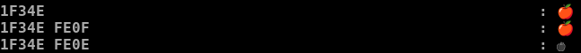

# Some thoughts about strings and their visual width in terminals

In this context "string" means a list of unicode codepoints.
And "terminals" means terminal emulators.


## There is no "the terminal width" for a unicode codepoint

Let's look at the following codepoint:

```
1F527                                                       : 🔧
```

Looks like this wrench `🔧` codepoint has some positive width.

But wait. If it's attached (with the Zero Width Joiner U+200D) to the
codepoint `👩` then you get:

```
1F469                                                       : 👩
1F469 1F527                                                 : 👩🔧
1F469 200D 1F527                                            : 👩‍🔧
```

In the last example the wrench is used to "modify" the `👩` in order
to produce a female mechanic.
In this context the wrench `🔧` has width 0.

Conclusion:

>
> The (terminal-)width of a codepoint may depend on the context.
>

So the idea to look for a function `width_of_codepoint(code_point)`
does not make any sense at all.

Between the first codepoint and the ZWJ U+200D there may also occur
a Fitzpatrick skin tone (which then has in this context also width 0):

```
1F469 1F3FB 200D 1F527                                      : 👩🏻‍🔧
1F469 1F3FB 200D 1F527                                      : 👩🏻‍🔧
1F469 1F3FC 200D 1F527                                      : 👩🏼‍🔧
1F469 1F3FD 200D 1F527                                      : 👩🏽‍🔧
1F469 1F3FE 200D 1F527                                      : 👩🏾‍🔧
1F469 1F3FF 200D 1F527                                      : 👩🏿‍🔧
```


## Extended Grapheme Cluster

Are there other objects where "width" might be well-defined?

Instead of focusing on the codepoints an other idea is to look for
visual units: one or more codepoints which are perceived as one
unit. Obviously that's not a definition.

The Unicode standard defines a conecpt called "extended grapheme
cluster", see [Unicode UAX #29](https://unicode.org/reports/tr29/#Table_Combining_Char_Sequences_and_Grapheme_Clusters). Let's call them ECG.


## The width of a ECG according to UAX 11

Reading in the Unicode specs one might think
[UAX #11](https://unicode.org/reports/tr11/)
might help. It defines(!) a width for ECG.

**BUT!**  _BUT!_ But! In general the so defined width has nothing to do
with the number of columns monospaced fonts (and/or terminal emulators)
use to render an ECG.

Let's cite Manish Goregaokar who wrote
[unicode_rs/unicode_width](https://github.com/unicode-rs/unicode-width)
to determine the width according to UAX 11:

> NOTE: The computed width values may not match the
>       actual rendered column width. 

For the female mechanic above the UAX 11 width will be larger than 2.


## A new hope

A new hope is needed if one really wants to have the
terminal-column-width (TCW). At the moment I cannot find a "standard"
or even a "definition" which tries to cover the TCW-problem.

There are several solutions and requests for solutions, like

* https://github.com/kovidgoyal/kitty/issues/3810
* https://github.com/jquast/wcwidth/issues/39

Just to name a few.

The most "sophisticated" attempt I can find is:
[rivo/uniseg: Monospace Width](https://pkg.go.dev/github.com/rivo/uniseg#hdr-Monospace_Width)


## Whishes

If one wants to align strings in the terminal and or truncate
them at a given column then typically the information of the TCW of the
whole string is not enough: Why? Becasue one typically wants to know:
What code points are used for the first 7 visual columns?

Take the string "o⃗, ë, ë and 🍎 are all ECG👈🏽" and let's use a "ruler":

```
          1         2
0123456789012345678901234567
││││││││││││││││││││││││││││
o⃗, ë, ë and 🍎 are all ECG👈🏽
```

Here are the codepoints:
6F 20D7 2C 20 65 308 2C 20 EB 20 61 6E 64 20 1F34E 20 61 72 65 20 61 6C 6C 20 45 43 47 1F448 1F3FD

A typical question: How many codepoints do I need, if I want to
truncate this string at the column number 16? [So that the result
has TCW of 17.] Here the answer is:
Use the codepoints range(0, 18) [0:18].

```
          1
01234567890123456
│││││││││││││││││
o⃗, ë, ë and 🍎 ar
```

And what about column number 12? 

```
          1
01234567890123
││││││││││││││
o⃗, ë, ë and 
o⃗, ë, ë and 🍎
```

Either you take the codepoints 0:14 or 0:15. In the first case the
columns 0 to 11 are occupied and in the second case the columns 0 to 13
are used. It is not possible to cut the apple in two halfs. Ohh. What
a bold claim! Wait, unicode makes this possible (sometimes).
Let's take a small detour for the apple:

```
1F34E                                                       : 🍎
1F34E FE0F                                                  : 🍎️
1F34E FE0E                                                  : 🍎︎
```

In some terminals you'll see:



OK. End of the detour.

What can be done to answer such questions:

A function of the type

```
  width_of_next_ecg(string, start_pos) -> (width, next_pos)
```

may do the job. As input you give a string and the starting position
where to look for the next ECG. This function is not looking "backwards".
It does *not* scan what is before start_pos. It looks "forward"
starting at start_pos and computes the width for the next ECG, returns
this width and how many codepoints went into this ECG. So that
next_pos can be used to get the informations of the next ECG.

```
      code points              ┃#cp ┃ TCW  ┃ ECG 
━━━━━━━━━━━━━━━━━━━━━━━━━━━━━━━╇━━━━╇━━━━━━╇━━━━╸
6F 20D7                        │  2 │    1 │ o⃗
2C                             │  1 │    1 │ ,
20                             │  1 │    1 │  
65 308                         │  2 │    1 │ ë
2C                             │  1 │    1 │ ,
20                             │  1 │    1 │  
EB                             │  1 │    1 │ ë
20                             │  1 │    1 │  
61                             │  1 │    1 │ a
6E                             │  1 │    1 │ n
64                             │  1 │    1 │ d
20                             │  1 │    1 │  
1F34E                          │  1 │    2 │ 🍎
20                             │  1 │    1 │  
61                             │  1 │    1 │ a
72                             │  1 │    1 │ r
65                             │  1 │    1 │ e
20                             │  1 │    1 │  
61                             │  1 │    1 │ a
6C                             │  1 │    1 │ l
6C                             │  1 │    1 │ l
20                             │  1 │    1 │  
45                             │  1 │    1 │ E
43                             │  1 │    1 │ C
47                             │  1 │    1 │ G
1F448 1F3FD                    │  2 │    2 │ 👈🏽

```
